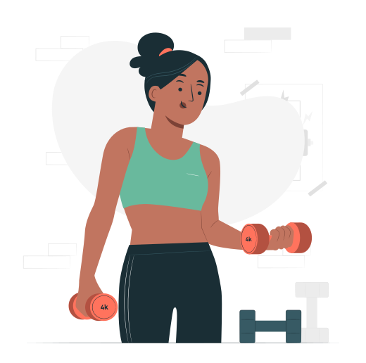

# 🏋 WorkoutAja Landing Home Page

This is a simple and clean landing page project called **WorkoutAja**, built using **HTML** and **CSS**. The page promotes exclusive workout sessions and includes responsive navigation, styled text sections, and interactive elements.

## 📁 Project Structure
```
📦 WorkoutAja
│── index.html
│── style.css
│── images
│ ├── logo.svg
│ ├── woman.svg
│ ├── whatsapp-icon.svg
│ └── balls.svg
```


## 📄 Description

- `index.html`: Contains the structure of the webpage. It includes a navigation bar, main section with headline and call-to-action button, and a footer.
- `style.css`: Handles all the styling of the website, including layout, colors, typography, and hover effects.

## ✅ What I Did

- Cleaned and improved the `style.css` file.
- Ensured consistent **font usage** by importing fonts from Google Fonts (`Mulish` and `Open Sans`).
- Styled the button to be interactive and have a modern, rounded appearance.
- Organized the layout using **Flexbox** to properly align content.
- Made sure the decorative elements (like `balls.svg`) are fixed and visually appealing.

## 🔧 Before and After Code Snippets

You can see some of the changes I made below:

### - HTML 

in HTML part I just make little adjustment like fixing the image not show

**Before:**
```


```

**After:**
```




```

### - CSS

### Navigation Link Styling

**Before:**
```
nav ul li a {
  
}

nav ul li a:hover {
  
}

```

**After:**
```
nav ul li a {
  font-family: 'Mulish', sans-serif;
  font-weight: 400;
  opacity: 0.5;
  font-size: 18px;
  text-decoration: none;
  color: #1F1534;
}

nav ul li a:hover {
  opacity: 1;
  font-weight: 700;
}

```

### Heading and Span Styling

**Before:**
```
.text h1 {
  font-family: 'Mulish', sans-serif;
}

.text h1 span {
}
```

**After:**
```
.text h1 {
  font-family: 'Mulish', sans-serif;
  font-weight: 400;
  font-size: 48px;
  letter-spacing: 0;
  line-height: 1.5;
  text-transform: uppercase;
  color: #000;
}

.text h1 span {
  color: #89C5CC;
  font-weight: 700;
}
```

### Paragraph Styling

**Before:**
```
.text p {
  font-family: 'Open Sans', sans-serif;
}
```

**After:**
```
.text p {
  font-family: 'Open Sans', sans-serif; 
  font-weight: 400;
  font-size: 16px;
  line-height: 1.6;
  letter-spacing: 0;
  color: #7D7987;
  margin-top: 16px;
}

```

### Button Styling

**Before:**
```
.text button {
  font-family: 'Open Sans', sans-serif;
  display: flex;
  gap: 8px;
}

.text button:hover {
}
```

**After:**
```
.text button {
  font-family: 'Open Sans', sans-serif;
  display: flex;
  gap: 8px;
  font-weight: 500;
  font-size: 16px;
  line-height: 1;
  letter-spacing: 0; 
  align-items: center;
  line-height: 21px;
  color: #F9F9F9;
  padding: 14px 32px;
  background: #69B99D;
  border-radius: 4px;
  border: none;
  margin-top: 48px;
}

.text button:hover {
  background-color: #599882;
}
```

### Footer Styling

**Before:**
```
footer {
  font-family: 'Open Sans', sans-serif;
}
```

**After:**
```
footer {
  font-family: 'Open Sans', sans-serif; 
  font-weight: 400;
  font-size: 14px;
  line-height: 1.6;
  letter-spacing: 0; 
  text-align: center;
  color: #000;
}
```

## 🛠️ Technologies Used

- HTML5
- CSS3 (with Flexbox)
- Google Fonts

## ✨ Features

- Hover effect on navigation links and button
- Custom typography using Google Fonts
- Well-commented and easy-to-read CSS

## 🚀 assignment source code

1. Clone the repository: \
`git clone https://github.com/cakrawala-university/web-client-development.git`

---
